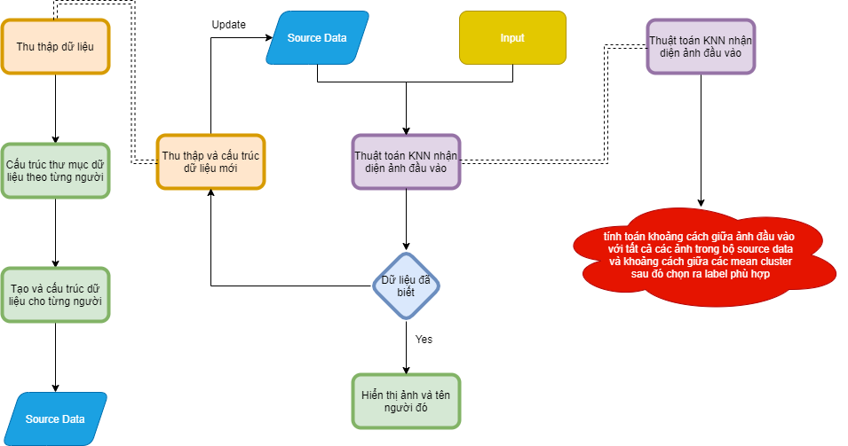

# Description
  This is a face recognition program using a slightly different version of the KNN algorithml. More specifically, I did not calculate all the distance but I add in a threshold beause while testing the output shows that the faces are relatively close. \\For more detail here is the algorithm diagram is below 
  

# Installation
  Create a new folder, then create another folder inside for the person that you want to recognize(you can create more folder for other person) and put their picture in their folder.
